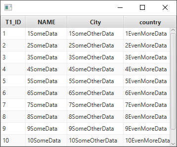

# JavaFXTableMapper
Simply use `ObjectTableView` in place of JavaFX's `TableView` and all of the work is handled for you.

## Example:

Model class:
```java
public class Test {

  private int id;
  private String name;
  private String city;
  private String country;
  
  // annotate with HiddenField to skip rendering in TableView
  @HiddenField
  private String internalId;
  
  // annotate with ColumnName to provide custom name for the TableView
  @ColumnName(name = "Pretty Column Name")
  private String someThingLongAndUnintuitive;
  
  // getters/setters/constructor here
  // a findAll() method implementation
}
```

JavaFX Application:
```java
import com.jfxdev.ObjectTableView; // our only class

ObservableList<Test> myObjects = Test.findAll();

// ObjectTableView takes care of mapping the object to a TableView
ObjectTableView<Test> table = new ObjectTableView<>(myObjects);

// use below constructor if we don't have our data yet, but still want the TableView
// ObjectTableView<Test> table = new ObjectTableView<>(Test.class); 
    
// Name multiple columns via Map
HashMap<String,String> columnNames = new HashMap<>();
columnNames.put("id", "T1_ID");
columnNames.put("name", "NAME");
table.applyColumnNameMapping(columnNames);

// or name them one at a time (a bit slower)
table.renameColumn("city", "City");
```


If we add the above `ObjectTableView` to a scene, we should end up with the following:
 

That's all folks, everything is handled in the `com.jfxdev.ObjectTableView` class. Feel free 
to use it in your own code or fork the repo.
